<h1 align="center"> 🏥 Hospital Management System </h1>

---
<p align="center">
A full-stack hospital management application built with <b>Angular</b> and <b>Spring Boot</b>.<br>
Role-based dashboards for <b>Doctors</b> and <b>Admins</b> to manage patients, appointments, and medicines.
</p>

---
## ✨ Features  

👨‍⚕️ **Doctor Dashboard**  
- 👀 View patients under treatment with diagnostic details  
- ➕ Add new patient records  
- ✏️ Update existing patient details  
- 🗑️ Delete patient records  
- 💊 Manage and maintain the medicine list  

🧑‍💼 **Admin Dashboard**  
- 👀 View current patient list (with sensitive details hidden)  
- ➕ Add new appointments  
- ✏️ Update existing appointments  
- 🗑️ Delete appointments  
- 👀 View appointment list  

## 🛠️ Tech Stack  

**Frontend:** Angular 14, TypeScript, HTML, CSS, JavaScript  
**Backend:** Spring Boot (Java)  
**Database:** MySQL 8 (Workbench CE-8)  

---
## 📸 Screenshots  

1. 🏠 Home Page  
   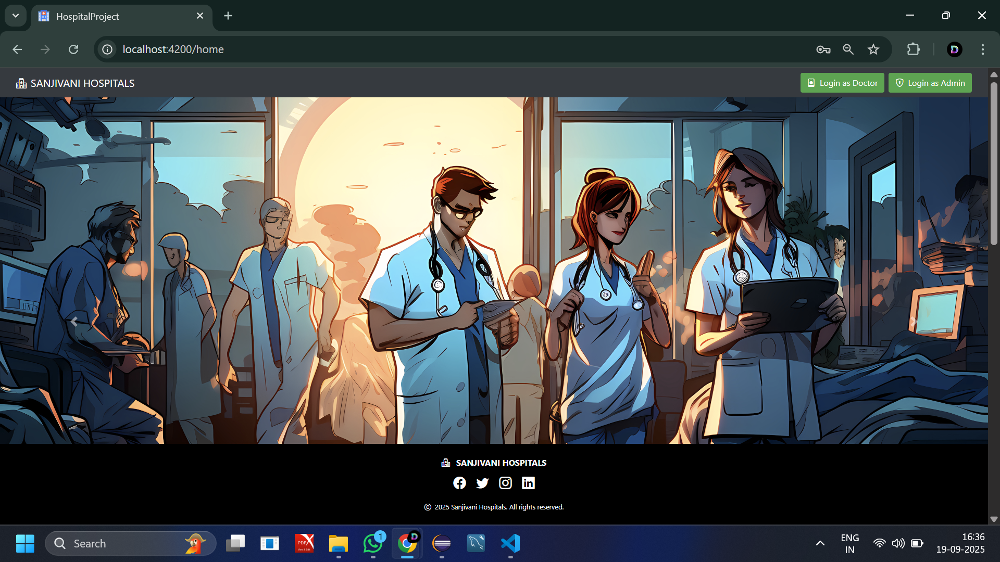  

2. 🔑 Doctor Login (Authentication)  
   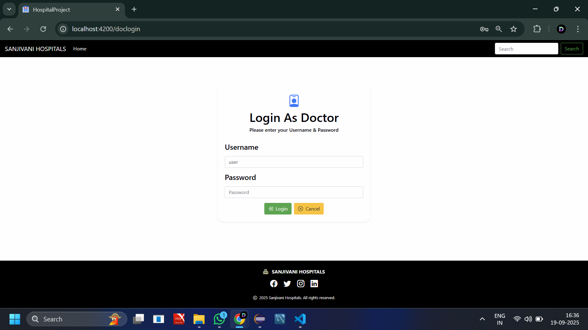  

3. 📊 Doctor Dashboard  
   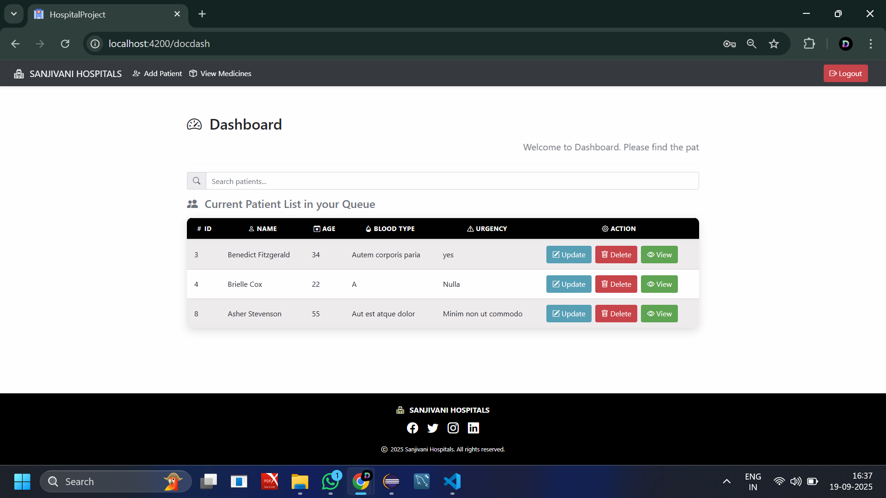  

4. 🔍 Search by Name  
   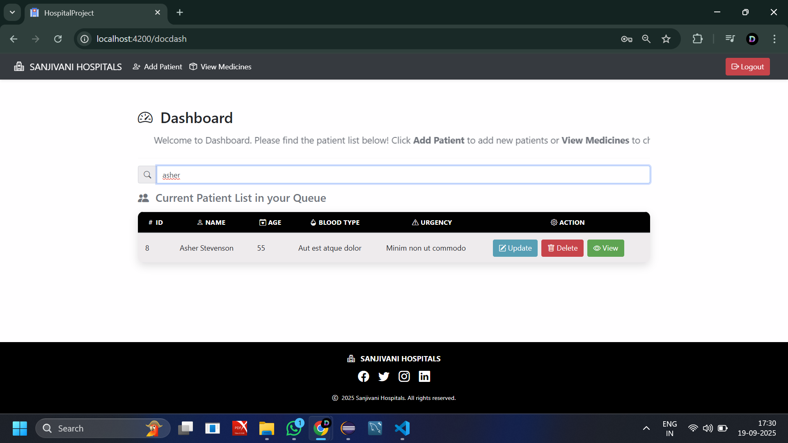  

5. 🧾 Patient Diagnostics  
   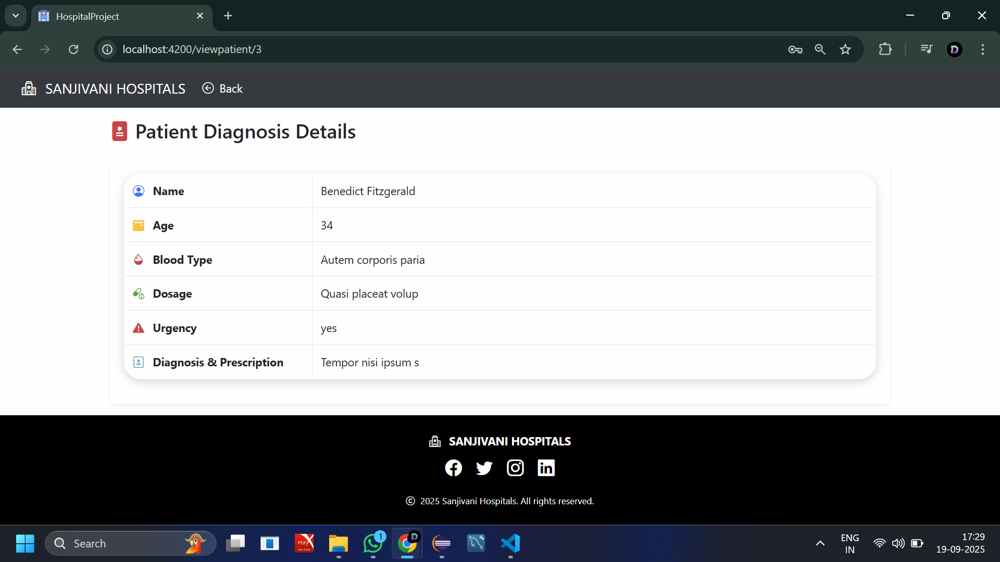  

6. ➕ Add Patient  
   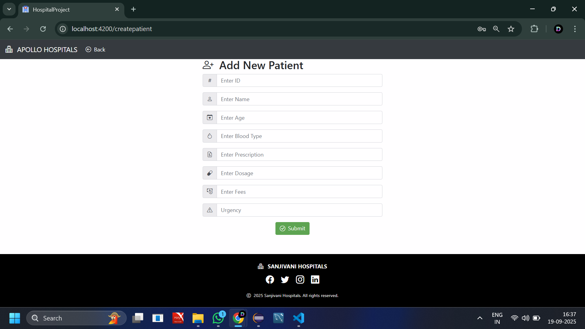  

7. ✏️ Update Patient  
   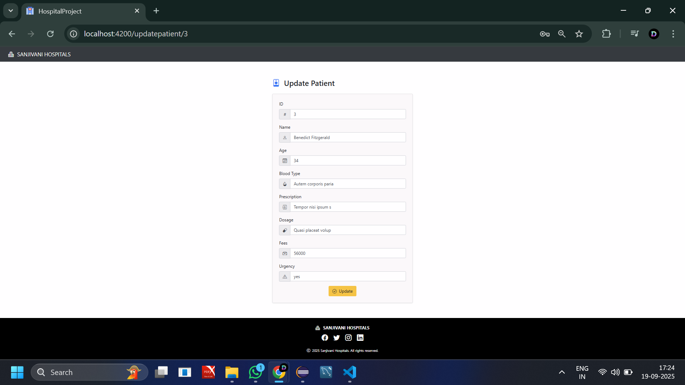  

8. 💊 Medicine List  
   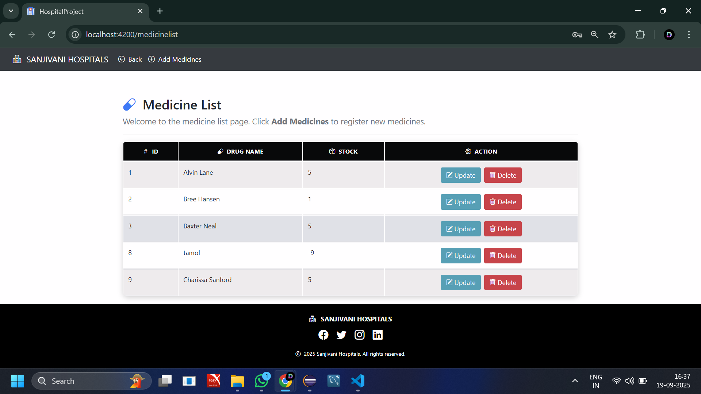  

9. ➕ Add Medicine  
   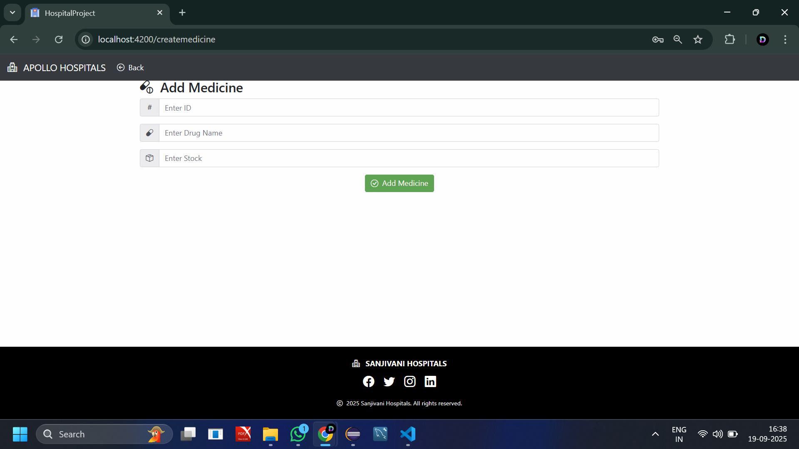  

10. 🔄 Update Medicine  
    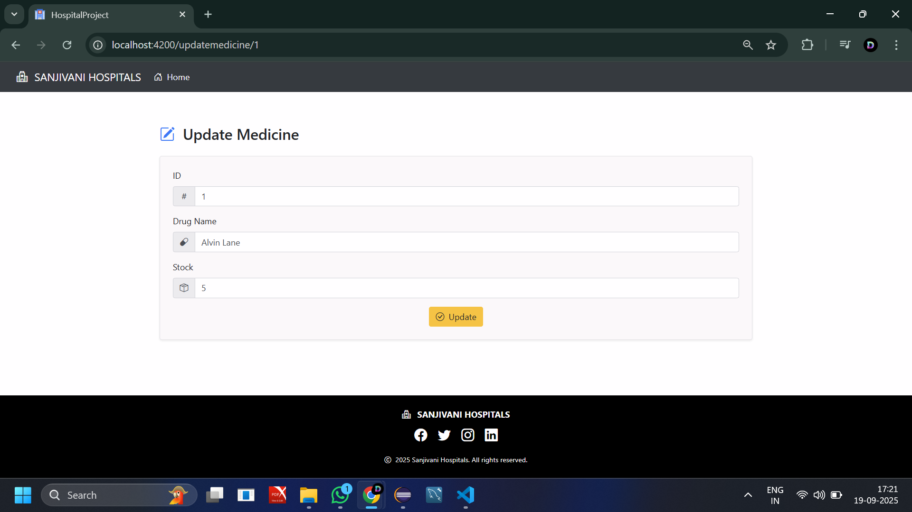  

11. 🔑 Admin Login  
    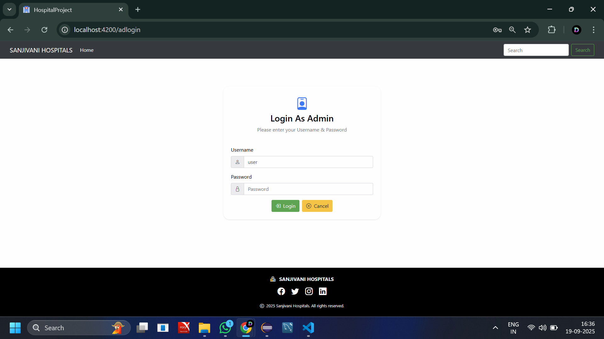  

12. 📊 Admin Dashboard  
    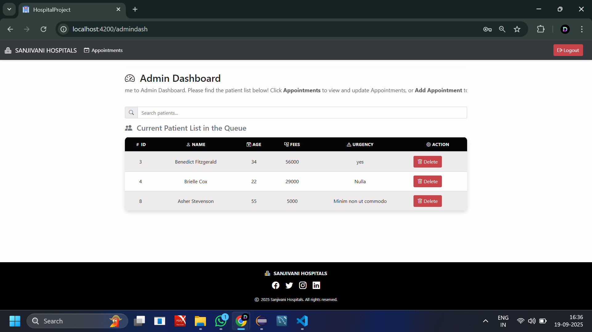  

13. 📅 Appointments  
    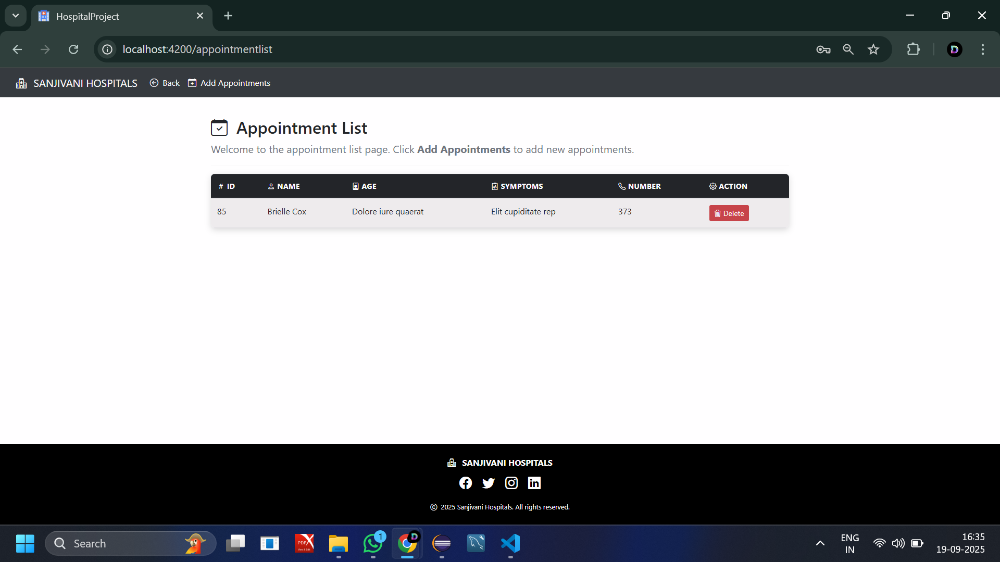  

14. 🆕 New Appointment  
    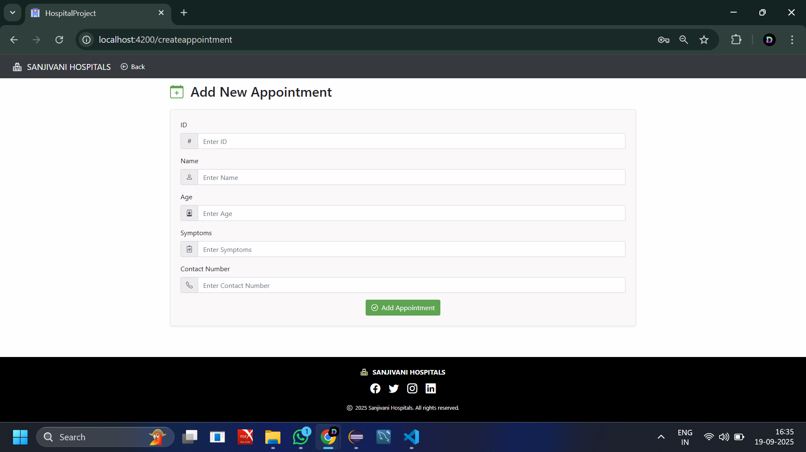  
---
## 🚀 Getting Started  

### 📌 Prerequisites  
- [Node.js](https://nodejs.org/) (for Angular)  
- [Angular CLI](https://angular.io/cli)  
- [Java JDK](https://www.oracle.com/java/)  
- [Spring Boot](https://spring.io/projects/spring-boot)  
- [MySQL 8](https://dev.mysql.com/downloads/mysql/)  

### ▶️ Run Frontend  
```bash
cd frontend
ng serve

   
